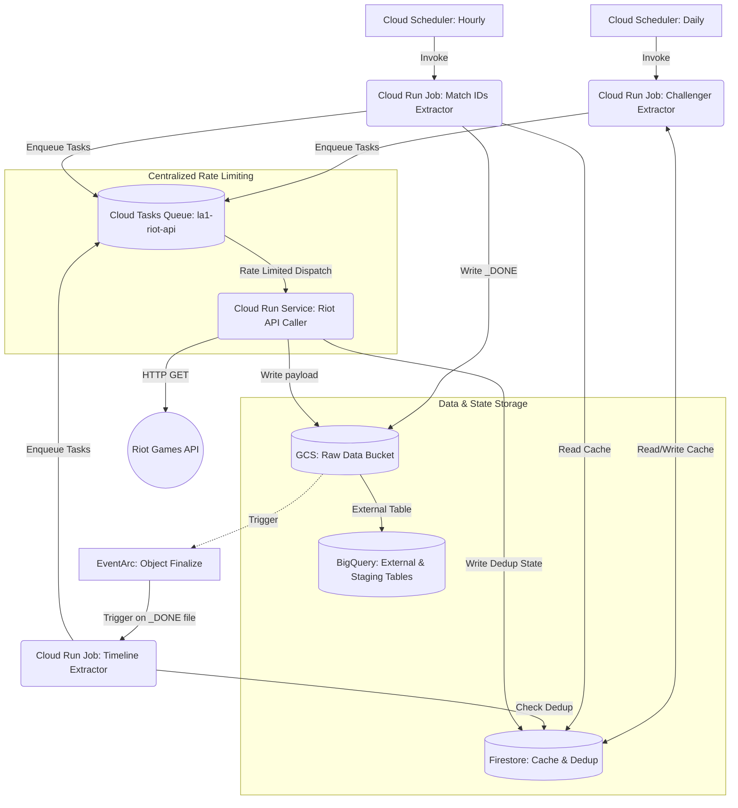

# Design: Riot API Extractor

## 1. Objective

The `riot-api-extractor` provides a resilient, multi-stage data pipeline to pull League of Legends Challenger league data (players, match IDs, and detailed match timelines) from the Riot Games API. It lands the data in Google Cloud Storage (GCS) as compressed JSON with robust metadata tracking. The pipeline leverages Cloud Tasks to strictly control outbound rate limits against the Riot API, and Firestore for fast, low-latency state tracking (summoner-to-puuid caching and match deduplication). While designed to production standards, the implementation will primarily run at a very small scale in the `dev` environment as a portfolio demonstration.

## 2. System Architecture & Data Flow

The architecture is broken down into three main extraction stages, all routed through a central Cloud Tasks rate-limiting queue.



### Data Flow Overview
1. **Challenger Extractor (Daily):** Triggered by Cloud Scheduler. Enqueues a task to fetch the challenger league. Uses Firestore to resolve `summonerId` to `puuid`, enqueuing additional summoner resolution tasks if a cache miss occurs.
2. **Match IDs Extractor (Hourly):** Triggered by Cloud Scheduler. Reads active `puuid`s from Firestore. Enqueues tasks to fetch recent match IDs for each player, passing the timestamp of the last successful run as the `startTime` parameter to the Riot API (optimizing API calls by only returning new matches). When all tasks complete, it writes a `_DONE` file to GCS.
3. **Timeline Extractor (Event-Driven):** Triggered by EventArc when the `_DONE` file is written. Reads discovered match IDs. Checks Firestore `processed_matches` collection to deduplicate. Enqueues tasks to fetch timelines for new matches.
4. **Cloud Run Service (API Caller):** Receives HTTP requests from Cloud Tasks. Executes the actual Riot API call, handles 429 retries, wraps the response in a metadata envelope, gzips it, and writes to GCS. It also updates Firestore (e.g., adding to `processed_matches`).

## 3. GCP Resource Mapping

| Resource | Purpose | IAM Roles Required | Estimated Cost (Monthly) |
|---|---|---|---|
| **Cloud Scheduler (x2)** | Trigger Challenger (daily) and Match IDs (hourly) jobs | `roles/run.invoker` | $0 (Free Tier covers 3 jobs) |
| **Cloud Tasks Queue** | Rate limit outbound Riot API requests per region (`la1`) | `roles/run.invoker` (to caller service) | $0 (Free Tier covers 1M ops) |
| **Cloud Run Jobs (x3)** | Orchestrate the three extraction stages | `roles/cloudtasks.enqueuer`, `roles/datastore.user` | < $1.00 (Minimal execution time) |
| **Cloud Run Service** | Execute actual API calls and write to GCS/Firestore | `roles/storage.objectCreator`, `roles/datastore.user`, `roles/secretmanager.secretAccessor` | < $1.00 (Minimal execution time) |
| **Firestore** | Caching `summonerId` -> `puuid` and Match deduplication | Accessed via above roles | $0 (Free Tier: 50K reads/day) |
| **GCS Bucket** | Store compressed JSON API responses and `_DONE` markers | `roles/storage.objectCreator` (Caller Service) | < $1.00 (Dev volume negligible) |
| **EventArc** | Trigger Timeline extractor on `_DONE` file | `roles/run.invoker` | $0 (Negligible events) |
| **Secret Manager** | Store `riot-games-api-key` | `roles/secretmanager.secretAccessor` (Caller Service) | $0 (Free Tier covers 6 active secrets) |
| **BigQuery** | External tables over GCS data, staging, and analytics tables | `roles/bigquery.dataEditor` (Dataform) | $0 (Free Tier covers 1TB queries) |

## 4. Security & Threat Model

*   **Authentication & Authorization:** 
    *   Service-to-service communication (Cloud Tasks -> Cloud Run Service, EventArc -> Cloud Run Job) is secured using OIDC authentication. Only authorized service accounts with `roles/run.invoker` can invoke the endpoints.
    *   The `riot-extractor-sa` service account will operate with the Principle of Least Privilege.
*   **Secret Management:** The Riot Games Dev API key is stored in GCP Secret Manager (`riot-games-api-key`). It is accessed at runtime by the API Caller Cloud Run Service and never logged or exposed in environment variables.
*   **Data Encryption:** All data is encrypted at rest (GCS, Firestore, BigQuery) and in transit (TLS) using Google-managed encryption keys (CMEK is out of scope to save costs).
*   **Network Boundaries:** Standard public ingress/egress. VPC Serverless Access Connectors are avoided to prevent the baseline ~$6.50/month cost, as the Riot API is public and all GCP resources are Google-managed.

## 5. Distributed Systems & Scalability Guarantees

*   **Outbound Rate Limiting:** Cloud Tasks enforces the Riot Dev Key limit (100 req / 2 min). The queue configuration will be set to a maximum of `0.8` dispatches per second (48 requests/minute) to provide a safety buffer.
    *   *Reference:* Riot API Rate Limits (https://developer.riotgames.com/docs/portal)
*   **Idempotency & Deduplication:** 
    *   Match processing is strictly deduplicated using Firestore point-lookups on `processed_matches/{matchId}`.
    *   API Caller service writes to GCS using deterministic paths (e.g., `gs://bucket/matches/region=la1/.../{matchId}.json.gz`).
*   **Retry Mechanisms:** Cloud Tasks handles retries automatically with exponential backoff if the Riot API returns a 5xx error or a 429 (Too Many Requests). The API Caller service will inspect the `Retry-After` header and optionally sleep or explicitly fail the task to delay retries accordingly.

## 6. Failure Mode & Blast Radius Analysis

*   **Riot API Outage (5xx/429s):** Cloud Tasks will back off and retry. If the outage exceeds task retention limits, tasks will drop. Alerting will fire on high queue error rates.
*   **Match ID Extractor Failure:** If this job fails, the `_DONE` file is never written. The Timeline Extractor is safely skipped.
*   **Firestore Outage:** Extraction jobs will fail (cannot resolve puuids or check dedup). Entire pipeline pauses gracefully until Firestore recovers.
*   **Poison Pill Tasks:** If a specific match ID consistently causes API errors (e.g., data corruption on Riot's end), Cloud Tasks will eventually exhaust retries and drop the task. This isolated failure does not impact other matches in the queue.

## 7. Data Contracts & Schemas

### GCS Path Structure (Hive Partitioned)
```text
gs://<bucket>/riot/league/region=<region>/year=<YYYY>/month=<MM>/day=<DD>/<league_id>.json.gz
gs://<bucket>/riot/matches/region=<region>/year=<YYYY>/month=<MM>/day=<DD>/<match_id>.json.gz
gs://<bucket>/riot/timelines/region=<region>/year=<YYYY>/month=<MM>/day=<DD>/<match_id>.json.gz
```

### JSON Metadata Envelope
Every API response written to GCS is wrapped in the following envelope:
```json
{
  "metadata": {
    "extraction_id": "uuid-v4",
    "cloud_run_job_id": "projects/PROJECT/locations/REGION/jobs/JOB_NAME",
    "cloud_run_execution_id": "projects/PROJECT/locations/REGION/jobs/JOB_NAME/executions/EXEC_ID",
    "source_api": "/lol/match/v5/matches/{matchId}",
    "region": "la1",
    "api_response_code": 200,
    "api_latency_ms": 342,
    "extracted_at": "2026-06-08T21:00:00Z",
    "extractor_version": "1.0.0"
  },
  "payload": { 
     /* Raw Riot API Response */ 
  }
}
```

### Firestore Schema
*   **Collection:** `summoners`
    *   **Document ID:** `{summonerId}`
    *   **Fields:** `puuid` (string), `lastUpdated` (timestamp)
*   **Collection:** `processed_matches`
    *   **Document ID:** `{matchId}`
    *   **Fields:** `extractedAt` (timestamp), `region` (string)

## 8. Datadog Monitoring Strategy

All Cloud Run services/jobs and Cloud Tasks metrics will be forwarded to the Datadog Pro account via GCP integration.

*   **Structured Logging:** JSON logs containing `job_type`, `region`, `player_puuid`, `match_id`, `api_latency_ms`, and `status_code` will be ingested by Datadog for log-based metric generation and dashboarding.
*   **Service Level Indicators (SLIs):**
    1.  **Job Success Rate:** Percentage of Cloud Run Jobs completing with status 0.
    2.  **API Error Rate:** Percentage of Riot API calls resulting in HTTP 4xx or 5xx (excluding expected 404s).
    3.  **Cache Hit Rate:** Ratio of Firestore summoner lookups vs Riot API summoner resolution calls.
    4.  **Task Queue Latency:** Average time a task spends in the queue before successful execution.
*   **Alert Thresholds:**
    *   *Warning:* Cache Miss Rate > 20% (indicates heavy influx of new players or cache expiry issues).
    *   *Critical:* Cloud Run Job failure (Match IDs or Timeline) for 2 consecutive runs.
    *   *Critical:* Riot API Error Rate > 10% over a 15-minute window.

## Change Log
| Date | Section Changed | What Changed | Why | Impact |
|---|---|---|---|---|
| YYYY-MM-DD | Initial Draft | N/A | N/A | N/A |
